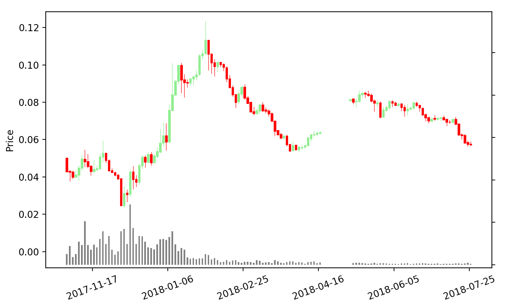

# Financial toolbox

The financial toolbox regroups a collection of useful functions to process cryptocurrencies and other market data.
It lets you import market data from different sources (currently only CSV), create meaningful features from a market dataset to feed machine learning algorithmes, and visualize those data.

__This toolbox is currently in development and more functions will be added time to time.__

## Installation
Simply download the pytorency folder and copy into in your project.

## Import market data

Market candles can be imported from CSV files. Times are supported either as timestamps or as text.

```python
import fintoolbox as ft
import fintoolbox.load

market = ft.load.market_from_csv('samples/BTC-ETH.csv', sep=';')
market.head()
```

The above code produces the following pandas dataframe where time is a [DatetimeIndex](https://pandas.pydata.org/pandas-docs/stable/generated/pandas.DatetimeIndex.html).

```
                         open      high       low     close  base_volume       volume
time
2017-10-31 00:00:00  0.050000  0.050145  0.049845  0.050000    52.650524  1052.762789
2017-10-31 01:00:00  0.050000  0.050145  0.050000  0.050000    54.579999  1090.576553
2017-10-31 02:00:00  0.050000  0.050435  0.050000  0.050208    94.177311  1876.060180
2017-10-31 03:00:00  0.050208  0.050389  0.050016  0.050210    65.767919  1308.115839
2017-10-31 04:00:00  0.050200  0.050400  0.050010  0.050200    64.754838  1288.355149
```

## Transform market data

### Market resampling

Let say you have an hourly dataset but you won't need that much precision. The function ``downscale_market`` can resample a market dataframe. In the example below, we downscale hourly candles to 2-day candles.


```python
import fintoolbox as ft
import fintoolbox.transform

market_2d = ft.transform.downscale_market(market, freq='2d')
market_2d.head()
```
```
                open      high       low    close   base_volume         volume
time                                                                          
2017-10-31  0.050000  0.050435  0.042800  0.04286   5824.147753  124559.619790
2017-11-02  0.042940  0.043475  0.037800  0.04260   9107.473992  222773.889780
2017-11-04  0.042600  0.043120  0.039000  0.04000   3727.084295   92015.885006
2017-11-06  0.039918  0.043407  0.039820  0.04100   5202.159551  125317.977368
2017-11-08  0.041000  0.046174  0.038119  0.04486  11638.793260  272094.869171
```

Now each row of the dataframe represents 2 days instead of 1 hour.


### Add variations

Variation columns can be easily calculated with the ``add_variation`` function. A variation is the ration of prices at two different epochs.
The following code adds the variation between the current on the upcoming epoch (from N+0 to N+1), as well as the variation over the 3 last epochs (from N-3 to N).

By default, variations are calculated on close prices. This can be changed with the ``column`` parameter.

```python
ft.transform.add_variation(market_2d, 0, 1)
ft.transform.add_variation(market_2d, -3, 0)
market_2d.head()
```

```python
                open      high       low    close   ...   var_N_N+1  var_N-3_N
time                                                                                  
2017-10-31  0.050000  0.050435  0.042800  0.04286   ...    0.993934        NaN
2017-11-02  0.042940  0.043475  0.037800  0.04260   ...    0.938967        NaN
2017-11-04  0.042600  0.043120  0.039000  0.04000   ...    1.025000        NaN
2017-11-06  0.039918  0.043407  0.039820  0.04100   ...    1.094144   0.956603
2017-11-08  0.041000  0.046174  0.038119  0.04486   ...    1.105325   1.053050
```

## Plotting

Prices and volumes can be plotted with Matplotlib with a single line of code :

```python
import fintoolbox.plotting
ft.plotting.plot_candles(market_2d)
```

